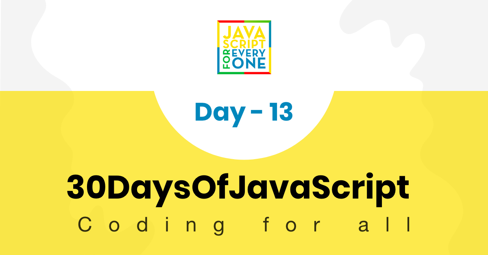

<div align="center">
  <h1> 30 Days Of JavaScript: Console Object Methods</h1>
  <a class="header-badge" target="_blank" href="https://www.linkedin.com/in/asabeneh/">
  
  </a>
  <a class="header-badge" target="_blank" href="https://twitter.com/Asabeneh">
  
  </a>

<sub>Author:
<a href="https://www.linkedin.com/in/asabeneh/" target="_blank">Asabeneh Yetayeh</a><br>
<small> January, 2020</small>
</sub>

</div>

[<< Day 12](../12_Day_Regular_expressions/12_day_regular_expressions.md) | [Day 14>>](../14_Day_Error_handling/14_day_error_handling.md)



- [Day 13](#day-13)
  - [Console Object Methods](#console-object-methods)
    - [console.log()](#consolelog)
    - [console.warn()](#consolewarn)
    - [console.error()](#consoleerror)
    - [console.table()](#consoletable)
    - [console.time()](#consoletime)
    - [console.info()](#consoleinfo)
    - [console.assert()](#consoleassert)
    - [console.group()](#consolegroup)
    - [console.count()](#consolecount)
    - [console.clear()](#consoleclear)
  - [💻 Exercises](#-exercises)
    - [Exercises: Level 1](#exercises-level-1)
    - [Exercises: Level 2](#exercises-level-2)
    - [Exercises: Level 3](#exercises-level-3)

# Day 13

## Console Object Methods

La console du navigateur est un outil très utile pour déboguer et vérifier les erreurs de notre code. Il existe différentes méthodes de console pour rendre le débogage plus facile et plus efficace.

### console.log()

La méthode `console.log` est utilisée pour afficher des messages d'information dans la console.

```js
console.log('30 Days of JavaScript')
console.log('%d %s of JavaScript', 30, 'Days')
console.log('%c30 Days Of JavaScript', 'color:green') // Utilisation de CSS pour styliser
```

### console.warn()

La méthode `console.warn` affiche des messages d'avertissement dans la console.

```js
console.warn('This is a warning message')
console.warn('Do not proceed without caution')
```

### console.error()

La méthode `console.error` affiche des messages d'erreur dans la console.

```js
console.error('This is an error message')
console.error('Something went wrong')
```

### console.table()

La méthode `console.table` affiche les données sous forme de tableau.

```js
const names = ['Asabeneh', 'Brook', 'David', 'John']
console.table(names)

const user = {
  name: 'Asabeneh',
  title: 'Programmer',
  country: 'Finland',
  city: 'Helsinki',
  age: 250
}
console.table(user)
```

### console.time()

La méthode `console.time` commence un minuteur pour suivre le temps écoulé pour une opération spécifique. La méthode `console.timeEnd` arrête le minuteur et affiche le temps écoulé.

```js
console.time('Regular for loop')
let sum = 0
for(let i = 0; i < 10; i++){
  sum += i
}
console.timeEnd('Regular for loop')
```

### console.info()

La méthode `console.info` affiche des messages d'information dans la console.

```js
console.info('This is an information message')
console.info('JavaScript is fun')
```

### console.assert()

La méthode `console.assert` affiche un message d'erreur si l'assertion est fausse.

```js
console.assert(10 > 2 * 10, '10 is not greater than 20')
console.assert(10 < 2 * 10, '10 is less than 20')
```

### console.group()

La méthode `console.group` permet de regrouper plusieurs messages sous un même en-tête. La méthode `console.groupEnd` ferme le groupe.

```js
console.group('Names')
console.log('Asabeneh')
console.log('Brook')
console.log('David')
console.groupEnd()
console.log('Some other logs')
```

### console.count()

La méthode `console.count` compte le nombre de fois où elle a été appelée avec une étiquette spécifique.

```js
console.count('Function called')
console.count('Function called')
console.count('Function called')
```

### console.clear()

La méthode `console.clear` efface la console.

```js
console.clear()
```

## 💻 Exercises

### Exercises: Level 1

1. Utilisez `console.log` pour afficher la chaîne de caractères '30 Days of JavaScript'.
2. Utilisez `console.warn` pour afficher un avertissement.
3. Utilisez `console.error` pour afficher un message d'erreur.

### Exercises: Level 2

1. Utilisez `console.table` pour afficher un tableau de pays.
2. Utilisez `console.time` pour calculer le temps d'exécution d'une boucle for.

### Exercises: Level 3

1. Utilisez `console.group` pour regrouper plusieurs messages.
2. Utilisez `console.assert` pour vérifier si une condition est vraie ou fausse.
