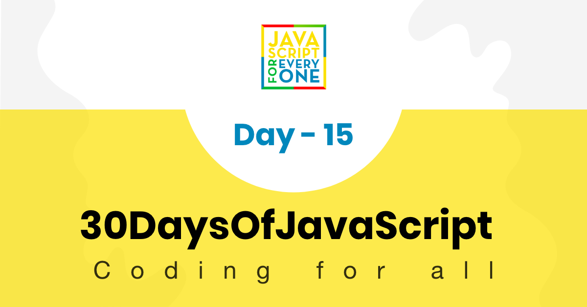

<div align="center">
  <h1> 30 Days Of JavaScript: Classes</h1>
  <a class="header-badge" target="_blank" href="https://www.linkedin.com/in/asabeneh/">
  
  </a>
  <a class="header-badge" target="_blank" href="https://twitter.com/Asabeneh">
  
  </a>

<sub>Author:
<a href="https://www.linkedin.com/in/asabeneh/" target="_blank">Asabeneh Yetayeh</a><br>
<small> January, 2020</small>
</sub>

</div>

[<< Day 14](../14_Day_Error_handling/14_day_error_handling.md) | [Day 16>>](../16_Day_JSON/16_day_json.md)



- [Day 15](#day-15)
  - [Classes](#classes)
    - [Defining a classes](#defining-a-classes)
    - [Class Instantiation](#class-instantiation)
    - [Class Constructor](#class-constructor)
    - [Default values with constructor](#default-values-with-constructor)
    - [Class methods](#class-methods)
    - [Getter](#getter)
    - [Setter](#setter)
    - [Static method](#static-method)
    - [Inheritance](#inheritance)
    - [Overriding methods](#overriding-methods)
  - [💻 Exercises](#-exercises)
    - [Exercises: Level 1](#exercises-level-1)
    - [Exercises: Level 2](#exercises-level-2)
    - [Exercises: Level 3](#exercises-level-3)

# Day 15

## Classes

Les classes sont des modèles pour créer des objets. Elles encapsulent des données avec du code pour travailler sur ces données. Les classes en JavaScript sont basées sur des prototypes, mais offrent une syntaxe plus pratique et plus proche de celle de la plupart des langages orientés objet.

### Defining a classes

Pour définir une classe en JavaScript, nous utilisons le mot-clé `class`, suivi par le nom de la classe.

```js
class Person {
}
```

### Class Instantiation

Pour créer une instance d'une classe, nous utilisons le mot-clé `new`.

```js
const person = new Person()
console.log(person)
```

### Class Constructor

Le constructeur est une méthode spéciale pour créer et initialiser un objet créé avec une classe.

```js
class Person {
  constructor(firstName, lastName) {
    this.firstName = firstName
    this.lastName = lastName
  }
}

const person = new Person('Asabeneh', 'Yetayeh')
console.log(person)
```

### Default values with constructor

Nous pouvons définir des valeurs par défaut pour les propriétés dans le constructeur.

```js
class Person {
  constructor(firstName = 'John', lastName = 'Doe') {
    this.firstName = firstName
    this.lastName = lastName
  }
}

const person1 = new Person()
const person2 = new Person('Asabeneh', 'Yetayeh')

console.log(person1)
console.log(person2)
```

### Class methods

Les méthodes de classe sont des fonctions définies à l'intérieur d'une classe.

```js
class Person {
  constructor(firstName, lastName) {
    this.firstName = firstName
    this.lastName = lastName
  }

  getFullName() {
    return `${this.firstName} ${this.lastName}`
  }
}

const person = new Person('Asabeneh', 'Yetayeh')
console.log(person.getFullName())
```

### Getter

Les getters sont des méthodes qui obtiennent la valeur d'une propriété spécifique.

```js
class Person {
  constructor(firstName, lastName) {
    this.firstName = firstName
    this.lastName = lastName
  }

  get getFullName() {
    return `${this.firstName} ${this.lastName}`
  }
}

const person = new Person('Asabeneh', 'Yetayeh')
console.log(person.getFullName)
```

### Setter

Les setters sont des méthodes qui définissent la valeur d'une propriété spécifique.

```js
class Person {
  constructor(firstName, lastName) {
    this.firstName = firstName
    this.lastName = lastName
  }

  set setFullName(fullName) {
    const parts = fullName.split(' ')
    this.firstName = parts[0]
    this.lastName = parts[1]
  }
}

const person = new Person('Asabeneh', 'Yetayeh')
person.setFullName = 'John Doe'
console.log(person)
```

### Static method

Les méthodes statiques sont appelées sur la classe elle-même, et non sur les instances de la classe.

```js
class Person {
  constructor(firstName, lastName) {
    this.firstName = firstName
    this.lastName = lastName
  }

  static greet() {
    return 'Hello'
  }
}

console.log(Person.greet())
```

### Inheritance

L'héritage est un mécanisme permettant de créer une nouvelle classe à partir d'une classe existante.

```js
class Student extends Person {
  constructor(firstName, lastName, course) {
    super(firstName, lastName)
    this.course = course
  }

  getCourse() {
    return this.course
  }
}

const student = new Student('Asabeneh', 'Yetayeh', 'JavaScript')
console.log(student)
console.log(student.getFullName())
console.log(student.getCourse())
```

### Overriding methods

Les méthodes d'une classe parente peuvent être redéfinies dans une classe enfant.

```js
class Student extends Person {
  constructor(firstName, lastName, course) {
    super(firstName, lastName)
    this.course = course
  }

  getFullName() {
    return `${this.firstName} ${this.lastName}, a student of ${this.course}`
  }
}

const student = new Student('Asabeneh', 'Yetayeh', 'JavaScript')
console.log(student.getFullName())
```

## 💻 Exercises

### Exercises: Level 1

1. Créez une classe `Person` avec des propriétés `firstName`, `lastName`, `age`, `country`, `city` et des méthodes `getFullName` et `getPersonInfo`.
2. Créez une classe `Student` qui hérite de la classe `Person` et ajoute une propriété `course` et une méthode `getStudentInfo`.

### Exercises: Level 2

1. Surchargez la méthode `getFullName` dans la classe `Student` pour inclure le cours.
2. Ajoutez une méthode statique dans la classe `Person` qui retourne `Human`.

### Exercises: Level 3

1. Créez une classe `Animal` avec des propriétés `name`, `age`, `color`, `legs` et une méthode `getAnimalInfo`.
2. Créez une classe `Dog` qui hérite de `Animal` et ajoute une propriété `breed` et une méthode `getBreed`.
3. Créez une classe `Cat` qui hérite de `Animal` et ajoute une propriété `breed` et une méthode `getBreed`.
