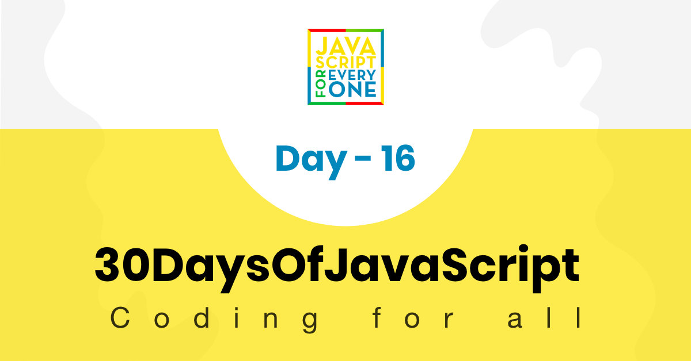

<div align="center">
  <h1> 30 Days Of JavaScript: JSON</h1>
  <a class="header-badge" target="_blank" href="https://www.linkedin.com/in/asabeneh/">
  
  </a>
  <a class="header-badge" target="_blank" href="https://twitter.com/Asabeneh">
  
  </a>

<sub>Author:
<a href="https://www.linkedin.com/in/asabeneh/" target="_blank">Asabeneh Yetayeh</a><br>
<small> January, 2020</small>
</sub>

</div>

[<< Day 15](../15_Day_Classes/15_day_classes.md) | [Day 17 >>](../17_Day_Web_storages/17_day_web_storages.md)



- [Day 16](#day-16)
  - [JSON](#json)
    - [Converting JSON to JavaScript Object](#converting-json-to-javascript-object)
      - [JSON.parse()](#jsonparse)
    - [Using a reviver function with JSON.parse()](#using-a-reviver-function-with-jsonparse)
    - [Converting Object to JSON](#converting-object-to-json)
      - [JSON.stringify()](#jsonstringify)
    - [Using a replacer function with JSON.stringify()](#using-a-replacer-function-with-jsonstringify)
  - [💻 Exercises](#-exercises)
    - [Exercises: Level 1](#exercises-level-1)
    - [Exercises: Level 2](#exercises-level-2)
    - [Exercises: Level 3](#exercises-level-3)

# Day 16

## JSON

JSON (JavaScript Object Notation) est un format léger d'échange de données. Il est facile à lire et à écrire pour les humains et facile à analyser et à générer pour les machines. JSON est une syntaxe pour sérialiser des objets, des tableaux, des nombres, des chaînes, des booléens et `null`.

### Converting JSON to JavaScript Object

Nous pouvons convertir des données JSON en objet JavaScript en utilisant `JSON.parse()`.

#### JSON.parse()

```js
const userText = '{"firstName":"Asabeneh","lastName":"Yetayeh","age":250,"skills":["HTML","CSS","JS","React","Node","Python"]}'

const userObj = JSON.parse(userText, undefined, 4)
console.log(userObj)
```

### Using a reviver function with JSON.parse()

Nous pouvons passer une fonction de transformation en tant que deuxième argument à `JSON.parse()` pour transformer les valeurs lors de la conversion.

```js
const user = {
  firstName: 'Asabeneh',
  lastName: 'Yetayeh',
  age: 250,
  skills: ['HTML', 'CSS', 'JS', 'React', 'Node', 'Python']
}

const userText = JSON.stringify(user, undefined, 4)
const userObj = JSON.parse(userText, (key, value) => {
  let newValue = typeof value == 'string' && key != 'skills' ? value.toUpperCase() : value
  return newValue
})

console.log(userObj)
```

### Converting Object to JSON

Nous pouvons convertir un objet JavaScript en JSON en utilisant `JSON.stringify()`.

#### JSON.stringify()

```js
const user = {
  firstName: 'Asabeneh',
  lastName: 'Yetayeh',
  age: 250,
  skills: ['HTML', 'CSS', 'JS', 'React', 'Node', 'Python'],
}

const userText = JSON.stringify(user, undefined, 4)
console.log(userText)
```

### Using a replacer function with JSON.stringify()

Nous pouvons passer une fonction de remplacement en tant que deuxième argument à `JSON.stringify()` pour remplacer les valeurs lors de la conversion.

```js
const user = {
  firstName: 'Asabeneh',
  lastName: 'Yetayeh',
  age: 250,
  skills: ['HTML', 'CSS', 'JS', 'React', 'Node', 'Python'],
}

const userText = JSON.stringify(user, (key, value) => {
  let newValue = typeof value == 'string' ? value.toUpperCase() : value
  return newValue
}, 4)

console.log(userText)
```

## 💻 Exercises

### Exercises: Level 1

1. Convertissez le texte JSON suivant en objet JavaScript :
```js
const usersText = `{
  "users":[
    {
      "firstName":"Asabeneh",
      "lastName":"Yetayeh",
      "age":250,
      "email":"asabeneh.yetayeh@clarusway.com"
    },
    {
      "firstName":"Alex",
      "lastName":"James",
      "age":25,
      "email":"alex.james@clarusway.com"
    },
    {
      "firstName":"Lidiya",
      "lastName":"Tekle",
      "age":28,
      "email":"lidiya.tekle@clarusway.com"
    }
  ]
}`
```

2. Utilisez la méthode `JSON.stringify()` pour convertir l'objet JavaScript `user` suivant en JSON.
```js
const user = {
  firstName: 'Asabeneh',
  lastName: 'Yetayeh',
  age: 250,
  email: 'asabeneh.yetayeh@clarusway.com'
}
```

### Exercises: Level 2

1. Stringifiez l'objet `users` suivant avec une fonction de remplacement pour convertir les valeurs de chaîne en majuscules.
```js
const users = {
  firstName: 'Asabeneh',
  lastName: 'Yetayeh',
  age: 250,
  email: 'asabeneh.yetayeh@clarusway.com'
}
```

2. Analysez le texte JSON suivant en objet JavaScript et utilisez une fonction de transformation pour convertir les valeurs de chaîne en minuscules.
```js
const usersText = `{
  "users":[
    {
      "firstName":"ASABENEH",
      "lastName":"YETAYEH",
      "age":250,
      "email":"ASABENEH.YETAYEH@CLARUSWAY.COM"
    },
    {
      "firstName":"ALEX",
      "lastName":"JAMES",
      "age":25,
      "email":"ALEX.JAMES@CLARUSWAY.COM"
    },
    {
      "firstName":"LIDIYA",
      "lastName":"TEKLE",
      "age":28,
      "email":"LIDIYA.TEKLE@CLARUSWAY.COM"
    }
  ]
}`
```

### Exercises: Level 3

1. Créez une fonction qui prend un objet JavaScript et le convertit en JSON.
2. Créez une fonction qui prend un texte JSON et le convertit en objet JavaScript.