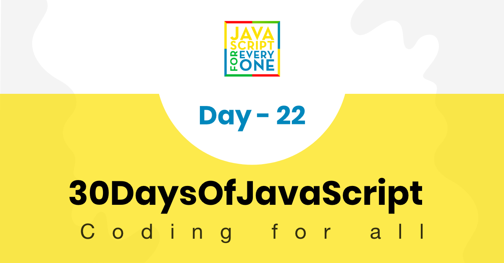

<div align="center">
  <h1> 30 Days Of JavaScript: Manipulating DOM Object</h1>
  <a class="header-badge" target="_blank" href="https://www.linkedin.com/in/asabeneh/">
  
  </a>
  <a class="header-badge" target="_blank" href="https://twitter.com/Asabeneh">
  
  </a>

<sub>Author:
<a href="https://www.linkedin.com/in/asabeneh/" target="_blank">Asabeneh Yetayeh</a><br>
<small> January, 2020</small>
</sub>

</div>

[<< Day 21](../21_Day_DOM/21_day_dom.md) | [Day 23 >>](../23_Day_Event_listeners/23_day_event_listeners.md)



- [Day 22](#day-22)
  - [DOM(Document Object Model)-Day 2](#domdocument-object-model-day-2)
    - [Creating an Element](#creating-an-element)
    - [Creating elements](#creating-elements)
    - [Appending child to a parent element](#appending-child-to-a-parent-element)
    - [Removing a child element from a parent element](#removing-a-child-element-from-a-parent-element)
    - [Replacing a child element](#replacing-a-child-element)
    - [Inserting Before](#inserting-before)
  - [💻 Exercises](#-exercises)
    - [Exercises: Level 1](#exercises-level-1)
    - [Exercises: Level 2](#exercises-level-2)
    - [Exercises: Level 3](#exercises-level-3)

# Day 22

## DOM(Document Object Model)-Day 2

### Creating an Element

Nous pouvons créer un élément HTML en utilisant la méthode `createElement`.

```js
let title = document.createElement('h1')
title.className = 'title'
title.textContent = 'Creating HTML element DOM Day 2'
console.log(title)
```

### Creating elements

Nous pouvons créer plusieurs éléments HTML en utilisant la méthode `createElement`.

```js
let title
for (let i = 0; i < 3; i++) {
  title = document.createElement('h1')
  title.className = 'title'
  title.style.fontSize = '24px'
  title.textContent = i
  console.log(title)
}
```

### Appending child to a parent element

Nous pouvons ajouter un enfant à un élément parent en utilisant la méthode `appendChild`.

```js
const body = document.querySelector('body')
const div = document.createElement('div')
const title = document.createElement('h1')
title.className = 'title'
title.textContent = 'Appending child to parent'
div.appendChild(title)
body.appendChild(div)
console.log(div)
```

### Removing a child element from a parent element

Nous pouvons supprimer un enfant d'un élément parent en utilisant la méthode `removeChild`.

```js
const body = document.querySelector('body')
const div = document.querySelector('div')
body.removeChild(div)
console.log(div)
```

### Replacing a child element

Nous pouvons remplacer un enfant d'un élément parent en utilisant la méthode `replaceChild`.

```js
const body = document.querySelector('body')
const div = document.createElement('div')
const title = document.createElement('h1')
title.className = 'title'
title.textContent = 'Replacing child element'
div.appendChild(title)
body.replaceChild(div, body.firstElementChild)
console.log(div)
```

### Inserting Before

Nous pouvons insérer un élément avant un autre élément en utilisant la méthode `insertBefore`.

```js
const body = document.querySelector('body')
const firstChild = body.firstElementChild
const title = document.createElement('h1')
title.className = 'title'
title.textContent = 'Inserting before'
body.insertBefore(title, firstChild)
console.log(title)
```

## 💻 Exercises

### Exercises: Level 1

1. Créez un élément `div` avec du texte à l'intérieur et ajoutez-le au `body`.
2. Créez plusieurs éléments `h1` avec des textes différents et ajoutez-les au `body`.

### Exercises: Level 2

1. Supprimez un élément `div` du `body`.
2. Remplacez un élément `h1` par un autre élément `h1`.

### Exercises: Level 3

1. Insérez un élément `h1` avant un autre élément `h1`.
2. Créez une liste d'éléments et ajoutez-les dynamiquement au `body`.