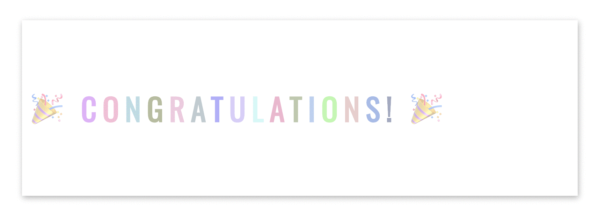

  <h1> 30 Days Of JavaScript: Projets Finaux</h1>
  
  

Author:
<a href="https://www.linkedin.com/in/asabeneh/" target="_blank">Asabeneh Yetayeh</a> 
<small> January, 2020</small>

<small>Soutenez l'<strong>auteur</strong> pour créer plus de matériel éducatif</small>    

[<< Day 29](../29_Day_Mini_project_animating_characters/29_day_mini_project_animating_characters.md)

- [Day 30](#day-30)
  - [Exercises](#exercises)
    - [Exercise: Level 1](#exercise-level-1)
    - [Exercise: Level 2](#exercise-level-2)
    - [Exercise: Level 3](#exercise-level-3)
  - [Testimony](#testimony)
  - [Support](#support)

# Day 30

## Exercises

### Exercise: Level 1

1. Créez l'animation suivante en utilisant (HTML, CSS, JS)

2. Validez le formulaire suivant en utilisant regex.

   

   

### Exercise: Level 2

### Exercise: Level 3

🌕 Votre parcours vers la grandeur s'est terminé avec succès. Vous avez atteint un niveau de grandeur élevé. Maintenant, vous êtes beaucoup plus grand qu'avant. Je savais ce qu'il fallait pour atteindre ce niveau et vous avez réussi. Vous êtes un véritable héros. Maintenant, il est temps de célébrer votre succès avec un ami ou en famille. J'attends avec impatience de vous voir dans un autre défi.

## Testimony

Il est maintenant temps de soutenir l'auteur en exprimant vos pensées sur l'auteur et le défi 30DaysOfJavaScript. Vous pouvez laisser votre témoignage sur ce [lien](https://testimonial-vdzd.onrender.com//)

## Support

Vous pouvez soutenir l'auteur pour produire plus de matériel éducatif

[<< Day 29](../29_Day_Mini_project_animating_characters/29_day_mini_project_animating_characters.md)
